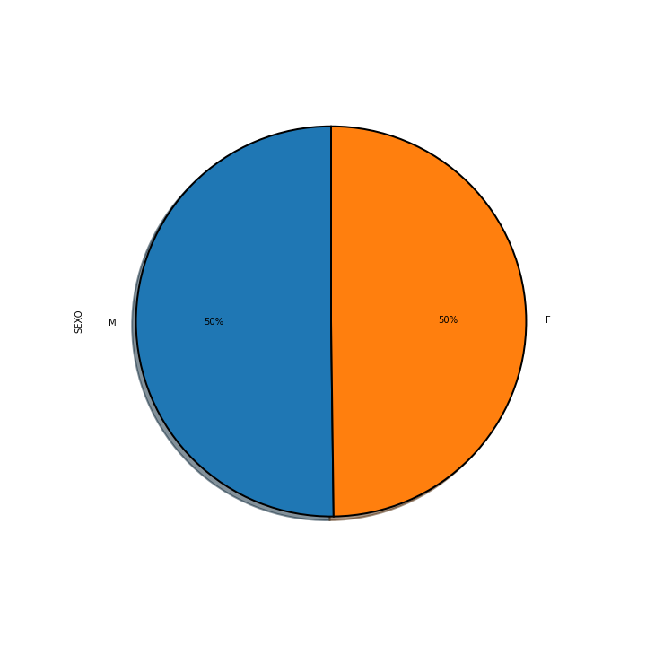
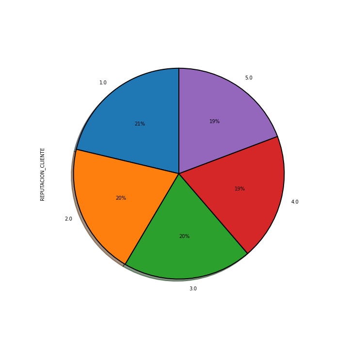
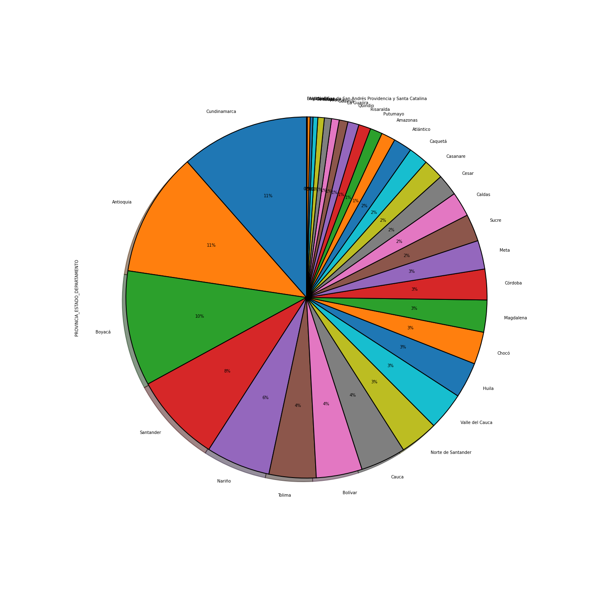
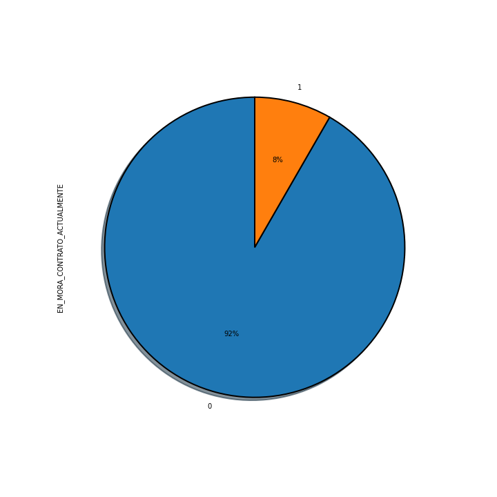

<p align="center">
	
</p>


# Cartera

La idea principal del código es optimizar, a través de esta herramienta, la recolección efectiva  de dinero en una empresa determinada. El concepto de cartera se define en base a las deudas que tengan los clientes de una empresa. Contablemente se define como la acción activa o pasiva de recoger recursos para la empresa o entidad ya sea por sus propios recursos o mediante terceros.

Este recaudo indica a todos los ingresos(no ganancias) en determinado tiempo y se mide por la entrada de dinero(ingreso), en simples términos, las ventas realizadas en ese determinado tiempo que se realicen a la empresa

Muchos de los expertos en el tema de recaudación de cartera (recolección de dinero de la empresa) recomienda que este recaudo se recolecte y se ubique por separado según el periodo de cada uno.

---

Este código pretende responder dos preguntas fundamentales:

1. ¿Quién va a incurrir en demora en el pago (Mora)?
2. ¿Podría estimar la fecha de pago del cliente?

## Clasificación - Mora

Para hacer la predicción se utiliza la base de datos incrustada en el servidor de azure con las siguientes credenciales 

```python
server   = "carterasvr.database.windows.net"
database = "cartera"
username = "consulta"
password = "D4t4b1z2.123" 
```

esto con el fin de poder hacer la petición de la base de datos. Se hace necesario contactar con el administrador y registrar la ip desde la cual se va a hacer la peticion. 

Adicional a esto desde el computador que se este trabajando se debe tener instalado un driver para poder hacer la petición al servidor, de lo contrario el codigo no funcionará, de encontrarse un error relacionadorelacionar el "Issue" en l repositorio en este caso el driver utilizado fue:

```python
driver = "{ODBC Driver 17 for SQL Server}"
```

Para poder hacer pruebas, dado que no se pueda configurar eñl conector a la base de datos se proporciona un archivo binario que contiene la base de datos de entrenamiento "data.frt". Para esto la siguiente bandera debe estar:

```python
download_data = False
```

### Estadística de los datos 

Se hace una descripción básica de los datos tratando de obtener características importantes detrás de la información. En primer lugar se empieza con los datos sociales de los registros del conjunto de datos.


#### Sexo

Esta variable se distribuye de manera uniforme en los datos, para este análizis se hace evidente que no es determinante la variable sexo, sin embargo se incluye en la base de datos del modelo para construir el modelo 


<p align="center">
	
</p>

#### Reputación del cliente

Esta es una variable categórica que clasifica los clientes dentro de cinco grupos, en donde el númer uno etiqueta a los clientes de peor reputación y el número cinco a los mejores. Se evidencia que las categorías están equilibradas.

<p align="center">
	
</p>

Existen variables en la base de datos de entrenamiento que se distribuyen de igual manera bajo una clasificación arbitraria de cinco grupos. Por eso no es de suma importancia mencionarlas como una variable determinante del modelo.

#### Ubicación

Dentro del conjunto de información se tiene la ubicación de los clientes listados en el registro, esta variable es de mucha importancia porque puede segmentar claramente si es que el cliente proviene de algun lugar el cual se lleve n la base de datos, a continucación se ve como se distribuyen en los datos los origines:

<p align="center">
	
</p>

#### Mora 

Esta variable tiene asociada varias variables, es decir, están muy correlacionadas entre sí, para bajar la complejidad del problema lo que se hace es plantear una medida de correlación pero entendiendo que es una variable categórica. Se busca una medida de asociación entre dos características categóricas. Para esto se utiliza la medida llamada **V de Cramér**. Se basa en una variación nominal de la prueba estadística de <a href="https://www.codecogs.com/eqnedit.php?latex=\chi^2" target="_blank"></a> de Pearson. 

Se asume una muestra de dos variables dadas por las frecuencias 

<div align="center">
	<a href="https://www.codecogs.com/eqnedit.php?latex=n_{ij}&space;=&space;\text{numero&space;de&space;veces&space;que&space;los&space;valores&space;}(A_{i},&space;B_{j})&space;\text{&space;son&space;observados}" target="_blank"></a>		
</div>

Tomando en cuenta la estadística <a href="https://www.codecogs.com/eqnedit.php?latex=\chi^2" target="_blank"></a> 

<div align="center">
	<a href="https://www.codecogs.com/eqnedit.php?latex=\chi^{2}=\sum_{i,j}\frac{\left(n_{i,j}-\frac{n_{i}n_{j}}{n}\right)^{2}}{\frac{n_{i}n_{j}}{n}}" target="_blank"></a>
</div>

la **V de Cramér** se calcula tomando la raíz cuadrada de la estaídistica <a href="https://www.codecogs.com/eqnedit.php?latex=\chi^2" target="_blank"></a> dividad por el tamaño de la muestra y la dimension de los datos menos uno, de la siguiente manera

<div>
	<a href="https://www.codecogs.com/eqnedit.php?latex=V&space;=&space;\sqrt{\frac{\chi^{2}}{n\&space;\text{min}(k-1,&space;r-1)}}" target="_blank"></a>
</div>

Se define la función que nos permite hacer esta correlación y poder discriminar los datos, este valor varia desde cero (Correspondiente a ninguna asociación entre variables) hasta uno (Asociación completa). Puede verso como la asociación entre dos variables como un porcentaje de su máxima varición posible

```python
def V(x, y):
    cm = pd.crosstab(x, y)
    chi2 = chi2_contingency(cm)[0]
    n = cm.sum().sum()
    phi2 = chi2/n
    r, k = cm.shape
    phi2corr = max(0, phi2-((k-1)*(r-1))/(n-1))
    rcorr = r - ((r-1)**2)/(n-1)
    kcorr = k - ((k-1)**2)/(n-1)
    return np.sqrt(phi2corr/min((kcorr-1), (rcorr-1)))
```
Esto lleva a solamente a adoptar la variable de si la persona actualmente se encuentra en mora 

<p align="center">
	
</p>